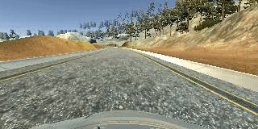

# **Udacity Self-Driving Car Engineer Nanodegree - Behavioral Cloning Project** 

---

**Behavioral Cloning Project**

The goals / steps of this project are the following:
* Use the simulator to collect data of good driving behavior
* Build, a convolution neural network in Keras that predicts steering angles from images
* Train and validate the model with a training and validation set
* Test that the model successfully drives around track one without leaving the road
* Summarize the results with a written report


---

### Introduction
The purpose of this project is to train a neural network to drive car base on the data collected using simulator provided by Udacity [here](.amazonaws.com/video.udacity-data.com/topher/2016/December/584f6edd_data/data.zip).

The data fed to the network or model is from the 3 dash cameras : Center, Left and Right. The simulator generates a csv file which maps Center, Left and Right image paths to steering angles, speed , brake. 

Keras framework is used for developing and training the network, afterwhich it is saved and model.h5 file is generated. The h5 file is loaded in the simulator and based on the live inputs(images) from simulator the network generates a steering angle which guides the car in the simulator.

---

[//]: # (Image References)

[image1]: ./Images/Model_Visualization.png "Model_Visualization"
[image2]: ./Images/Data_Distribution.png "Data_Distribution"
[image3]: ./Images/recovery1.jpg "Recovery_Image"
[image4]: ./Images/recovery2.jpg "Recovery_Image"
[image5]: ./Images/recovery3.jpg "Recovery_Image"
[image6]: ./Images/recovery4.jpg "Normal_Image"
[image7]: ./Images/flipped.png "Flipped_Image"
[image8]: ./Images/Generator_Batch1.png "Generator_Batch1"
[image9]: ./Images/Generator_Batch2.png "Generator_Batch2"
[image10]: ./Images/Generator_Batch3.png "Generator_Batch3"
[image11]: ./Images/cropped.png "cropped image"
[image12]: ./Images/resize.png "resizing"


## Rubric Points
### Here I will consider the [rubric points](https://review.udacity.com/#!/rubrics/432/view) individually and describe how I addressed each point in my implementation.  

---
### Files Submitted & Code Quality

#### 1. Submission includes all required files and can be used to run the simulator in autonomous mode

My project includes the following files:
* model.py containing the script to create and train the model
* drive.py for driving the car in autonomous mode
* model.h5 containing a trained convolution neural network 
* writeup_report.md or writeup_report.pdf summarizing the results

#### 2. Submission includes functional code
Using the Udacity provided simulator and my drive.py file, the car can be driven autonomously around the track by executing 
```sh
python drive.py model.h5
```

#### 3. Submission code is usable and readable

The model.py file contains the code for training and saving the convolution neural network. The file shows the pipeline I used for training and validating the model, and it contains comments to explain how the code works.

### Model Architecture and Training Strategy

#### 1. An appropriate model architecture has been employed

1. The implemented model consists of a convolution neural network with 3x3 and 5x5 filter sizes and depths between 32 and 128 (model.py lines 175-223) .
2. The model includes RELU layers after every conv layer to introduce nonlinearity (eg : code line 190).
3. The data is normalized in the model using a Keras lambda layer (code line 187). 

#### 2. Attempts to reduce overfitting in the model

1. The model contains dropout layers after every Dense layer in order to reduce overfitting (model.py lines 212). 
2. Batch Normalisation layers are added after every conv layer to help reduce overfitting (model.py lines 192).
3. The model was trained and validated on different data sets to ensure that the model was not overfitting (code line 140-145). 
4. The model was tested by running it through the simulator and ensuring that the vehicle could stay on the track.

#### 3. Model parameter tuning

The model used an adam optimizer. 

#### 4. Appropriate training data

Training data was chosen to keep the vehicle driving on the road. I used a combination of center lane driving, recovering from the left and right sides of the road. Also my training data included one lap of driving in the reverse direction. All the training data was obtained from Track-1. 

For details about how I created the training data, see the next section. 

### Model Architecture and Training Strategy

#### 1. Solution Design Approach

My implementation uses [nVidia model](https://images.nvidia.com/content/tegra/automotive/images/2016/solutions/pdf/end-to-end-dl-using-px.pdf) based model as suggested during the course with certain tweaks for combating overfitting. The following diagram depicts the same

![alt text][image1]

I implemented the model using Keras framework, the model starts with a cropping layer followed by lambda layers for resizing and image normalization. Post these layers, a similar implementation of nVidia model follows.

In order to gauge how well the model was working, I split my image and steering angle data into a training and validation set. The validation set was 20% of the data.

To combat the overfitting, I modified the model and added dropout and batch normalization layers.

The final step was to run the simulator to see how well the car was driving around track one. There were a few spots where the vehicle fell off the track... to improve the driving behavior in these cases, I ....

At the end of the process, the vehicle is able to drive autonomously around the track without leaving the road.

#### 2. Final Model Architecture

The final model architecture (model.py lines 175-223) consisted of a convolution neural network with the following layers and layer sizes

| Layer (type)                 	| Output Shape       	|
|------------------------------	|--------------------	|
| cropping2d_1 (Cropping2D)    	| (None, 60, 320, 3) 	|
| lambda_1 (Lambda)            	| (None, 60, 120, 3) 	|
| lambda_2 (Lambda)            	| (None, 60, 120, 3) 	|
| conv2d_1 (Conv2D)            	| (None, 60, 120, 3) 	|
| elu_1 (ELU)                  	| (None, 60, 120, 3) 	|
| batch_normalization_1 (Batch 	| (None, 60, 120, 3) 	|
| conv2d_2 (Conv2D)            	| (None, 30, 60, 16) 	|
| elu_2 (ELU)                  	| (None, 30, 60, 16) 	|
| batch_normalization_2 (Batch 	| (None, 30, 60, 16) 	|
| conv2d_3 (Conv2D)            	| (None, 15, 30, 32) 	|
| elu_3 (ELU)                  	| (None, 15, 30, 32) 	|
| batch_normalization_3 (Batch 	| (None, 15, 30, 32) 	|
| conv2d_4 (Conv2D)            	| (None, 8, 15, 64)  	|
| elu_4 (ELU)                  	| (None, 8, 15, 64)  	|
| batch_normalization_4 (Batch 	| (None, 8, 15, 64)  	|
| conv2d_5 (Conv2D)            	| (None, 4, 8, 128)  	|
| elu_5 (ELU)                  	| (None, 4, 8, 128)  	|
| flatten_1 (Flatten)          	| (None, 4096)       	|
| elu_6 (ELU)                  	| (None, 4096)       	|
| dense_1 (Dense)              	| (None, 512)        	|
| dropout_1 (Dropout)          	| (None, 512)        	|
| elu_7 (ELU)                  	| (None, 512)        	|
| dense_2 (Dense)              	| (None, 100)        	|
| dropout_2 (Dropout)          	| (None, 100)        	|
| elu_8 (ELU)                  	| (None, 100)        	|
| dense_3 (Dense)              	| (None, 10)         	|
| dropout_3 (Dropout)          	| (None, 10)         	|
| elu_9 (ELU)                  	| (None, 10)         	|
| dense_4 (Dense)              	| (None, 1)          	|

Total params: 2,256,857

Trainable params: 2,256,627

Non-trainable params: 230


#### 3. Creation of the Training Set & Training Process

##### Data collection and extraction

To capture good driving behavior, I first recorded two laps on track one using center lane driving. Here is an example image of center lane driving:

![alt text][image6]

I then recorded the vehicle recovering from the left side and right sides of the road back to center so that the vehicle would learn to steer to center if it runs into issues.
The following images show recovery maneuver from left to center of road:

![alt text][image3]

![alt text][image4]

![alt text][image5]

In training mode, the simulator generates a CSV file which contains the path for the image and maps the steering to the same. The function **dataextractor** defined in model.py lines 17-44. The function returns absolute path for images and their respective angles. The function also adds left and right images path to the return and the angles is adjusted by -0.2 for left and +0.2 for right.

After the collection process, I had 30000 number of data points. 

One problem with collected data was that the data set was not equally distributed, most of the training data contains steering values of around **0, 0.2, -0.2**. This I refer as high frequency data. Following Histogram shows the distribution.

![alt text][image2]

##### Preprocessing of Data
The preprocessing steps included the following:
1. Change in color space : As the images are read using cv2.imread the output is in BGR space, hence it needs to be converted to RGB color space.
2. Cropping layer : The output image from 1 is cropped to 60x320. Following is a sample :
![alt text][image11]
3. Resizing layer : The image is resized to 60x120. Following is a sample of same :
![alt text][image12]

##### Augmentation of Data and Generator

The augmentation function : **generator** defined in model.py lines 85-137, the function does the data augmentation by flipping images, the function works in a way that in a given cycle the output batch contains only 20% of data is taken from high frequency data. 
Following are the histograms for batch size of 256 samples from generator:

**cycle1**

![alt text][image8]

**cycle2**

![alt text][image9]

**cycle3**

![alt text][image10]

To augment the data set, I also flipped images and angles thinking that this would help model generalize. This also increases the number of samples for the angles other than High Frequency data. For example, here is an image that has then been flipped:

![alt text][image7]

I finally randomly shuffled the data set and put 20% of the data into a validation set. 

##### Training and Results

I used this training data for training the model. The validation set helped determine if the model was over or under fitting. The ideal number of epochs was 10 as evidenced by the logs below.
I used an adam optimizer so that manually training the learning rate wasn't necessary. however I adjusted the learning rates based on the losses.

One important implementation for training was to retrain the existing model. My approach was iterative, I started training at optimizer learning rate 0f 0.0001 for 10 epocs , following are the logs for the same:

**Epoch 1/10**

244/244 [==============================] - 55s - loss: 0.2557 - acc: 0.0500 - val_loss: 0.0735 - val_acc: 0.0660

**Epoch 2/10**

244/244 [==============================] - 54s - loss: 0.2483 - acc: 0.0507 - val_loss: 0.0645 - val_acc: 0.0697

**Epoch 3/10**

244/244 [==============================] - 54s - loss: 0.2431 - acc: 0.0507 - val_loss: 0.0622 - val_acc: 0.0725

**Epoch 4/10**

244/244 [==============================] - 54s - loss: 0.2386 - acc: 0.0505 - val_loss: 0.0617 - val_acc: 0.0702

**Epoch 5/10**

244/244 [==============================] - 54s - loss: 0.2326 - acc: 0.0548 - val_loss: 0.0671 - val_acc: 0.0692

**Epoch 6/10**

244/244 [==============================] - 55s - loss: 0.2283 - acc: 0.0514 - val_loss: 0.0605 - val_acc: 0.0693

**Epoch 7/10**

244/244 [==============================] - 54s - loss: 0.2207 - acc: 0.0547 - val_loss: 0.0564 - val_acc: 0.0751

**Epoch 8/10**

244/244 [==============================] - 55s - loss: 0.2183 - acc: 0.0562 - val_loss: 0.0609 - val_acc: 0.0708

**Epoch 9/10**

244/244 [==============================] - 54s - loss: 0.2154 - acc: 0.0540 - val_loss: 0.0572 - val_acc: 0.0693

**Epoch 10/10**

244/244 [==============================] - 54s - loss: 0.2041 - acc: 0.0547 - val_loss: 0.0544 - val_acc: 0.0683

I then tested the model on simulator, but the model was leaving the road at sharp curve. Thus I decided to further train the model and also I increased the learning rate to 0.001.

My implementation includes loading of pre trained model, changing the learning rate of optimizer and training the model.

I further trained the model for 5 epocs at learning rate of 0.001. Following are the logs of the same:

**Epoch 1/5**

244/244 [==============================] - 56s - loss: 0.1790 - acc: 0.0625 - val_loss: 0.0414 - val_acc: 0.0736

**Epoch 2/5**

244/244 [==============================] - 54s - loss: 0.0739 - acc: 0.0703 - val_loss: 0.0351 - val_acc: 0.0693

**Epoch 3/5**

244/244 [==============================] - 54s - loss: 0.0510 - acc: 0.0740 - val_loss: 0.0357 - val_acc: 0.0711

**Epoch 4/5**

244/244 [==============================] - 54s - loss: 0.0413 - acc: 0.0741 - val_loss: 0.0364 - val_acc: 0.0701

**Epoch 5/5**

244/244 [==============================] - 54s - loss: 0.0391 - acc: 0.0710 - val_loss: 0.0357 - val_acc: 0.0686

After the second training the loss had decreased by a large amount.

Post this I verified the model on simulator and the network was successful in driving the entire track-1. The same is recorded in video.mp4 file.

# Output Videos



##### Conclusion

One important thing I take from this particular exercise is that data is very important to make something work end to end, (image to steering angle). This I say because when I introduced my model to challenge track or Track-2, the model was not able to perform as it did on Track-1. This gives an intuition that if we want to train a network for end to end, the amount of data required would be very high to ensure that model works in any environment.

Also I feel it will be difficult to debug such end to end network, instead if we split the network as perception -> planning ->control, it will be easy to identify which part the problem lies.

